# Esquema de la Base de Datos: edd n'dev Portfolio

**Versión:** 1.0
**Fecha de Creación:** 2025-10-04
**Motor de Base de Datos:** MySQL 8.x
**Framework ORM:** Eloquent (Laravel 12)

Este documento visualiza la arquitectura de la base de datos del proyecto. Define las tablas principales, sus relaciones y campos importantes para el portafolio web de edd n'dev.

---

## Diagrama de Relaciones (ERD)

```mermaid
erDiagram
    %% Blog System
    posts ||--o{ post_tag : "tiene"
    tags ||--o{ post_tag : "aparece en"
    posts }o--|| categories : "pertenece a"

    %% Projects System
    projects ||--o{ project_technology : "usa"
    technologies ||--o{ project_technology : "usada en"
    projects }o--|| project_types : "es de tipo"

    %% Resources/Learning System
    resources ||--o{ resource_tag : "tiene"
    tags ||--o{ resource_tag : "aparece en"
    resources }o--|| resource_categories : "pertenece a"

    %% Contact System
    contact_submissions {
        int id PK
        string name
        string email
        string subject
        text message
        string status "pending, read, replied, archived"
        datetime read_at
        datetime created_at
        datetime updated_at
    }

    posts {
        int id PK
        string title UK
        string slug UK
        text excerpt
        text content "HTML desde CMS"
        string featured_image
        int category_id FK
        string status "draft, published, archived"
        int views "Contador de vistas"
        datetime published_at
        datetime created_at
        datetime updated_at
        datetime deleted_at "Soft delete"
    }

    categories {
        int id PK
        string name UK
        string slug UK
        text description
        string color "Hex color para UI"
        int posts_count "Cache count"
        datetime created_at
        datetime updated_at
    }

    tags {
        int id PK
        string name UK
        string slug UK
        string type "post, resource, project"
        datetime created_at
        datetime updated_at
    }

    post_tag {
        int id PK
        int post_id FK
        int tag_id FK
        datetime created_at
    }

    projects {
        int id PK
        string title UK
        string slug UK
        text description
        text full_description
        string thumbnail
        string featured_image
        int project_type_id FK "client or personal/opensource"
        string demo_url "URL de demo si existe"
        string repo_url "URL de repositorio GitHub"
        string status "draft, published, archived"
        boolean is_featured "Para destacar en homepage"
        int order "Orden de visualización"
        datetime completed_at
        datetime created_at
        datetime updated_at
        datetime deleted_at
    }

    project_types {
        int id PK
        string name UK "Client, Personal, Open Source"
        string slug UK
        string icon "Heroicon name"
        datetime created_at
        datetime updated_at
    }

    technologies {
        int id PK
        string name UK "React, Laravel, Tailwind, etc"
        string slug UK
        string icon "URL o nombre de icono"
        string category "frontend, backend, database, devops, etc"
        string color "Color para badge"
        datetime created_at
        datetime updated_at
    }

    project_technology {
        int id PK
        int project_id FK
        int technology_id FK
        datetime created_at
    }

    resources {
        int id PK
        string title UK
        string slug UK
        text description
        text content "HTML desde CMS"
        string type "course, guide, template, ebook, cheatsheet"
        int resource_category_id FK
        string thumbnail
        string download_url "Para recursos descargables"
        string external_url "Para cursos externos"
        boolean is_free
        int downloads_count "Contador de descargas"
        string status "draft, published, archived"
        datetime published_at
        datetime created_at
        datetime updated_at
        datetime deleted_at
    }

    resource_categories {
        int id PK
        string name UK
        string slug UK
        text description
        string icon
        int resources_count
        datetime created_at
        datetime updated_at
    }

    resource_tag {
        int id PK
        int resource_id FK
        int tag_id FK
        datetime created_at
    }
```



---

## Descripción de Tablas

### posts (Artículos del Blog)

**Propósito:** Almacena los artículos del blog escritos desde el CMS. Incluye tutoriales, experiencias, opinión técnica y reflexiones.

**Campos importantes:**
- `title`: Título del artículo (único)
- `slug`: URL-friendly version del título (único, para SEO)
- `excerpt`: Resumen corto del artículo (usado en listados)
- `content`: Contenido completo del artículo en HTML (generado desde editor WYSIWYG del CMS)
- `featured_image`: Ruta de la imagen destacada
- `category_id`: Relación con categoría del artículo
- `status`: Estado del artículo (draft, published, archived)
- `views`: Contador de vistas del artículo
- `published_at`: Fecha de publicación (puede ser diferente a created_at para posts programados)
- `deleted_at`: Soft delete para recuperación

**Relaciones:**
- Pertenece a una `category` (muchos a uno)
- Tiene muchos `tags` a través de `post_tag` (muchos a muchos)

**Índices:**
- Índice en `slug` para búsquedas rápidas por URL
- Índice en `status` para filtrar posts publicados
- Índice en `published_at` para ordenar cronológicamente
- Índice compuesto en `(status, published_at)` para listados optimizados

---

### categories (Categorías de Blog)

**Propósito:** Organiza los artículos del blog en categorías principales (ej: Tutoriales, Desarrollo Web, Marketing, Experiencias).

**Campos importantes:**
- `name`: Nombre de la categoría
- `slug`: URL-friendly slug
- `description`: Descripción de la categoría
- `color`: Color hex para mostrar en UI (badges, headers)
- `posts_count`: Cache del número de posts (actualizado por observers)

**Relaciones:**
- Tiene muchos `posts` (uno a muchos)

---

### tags (Etiquetas)

**Propósito:** Sistema unificado de tags para posts, recursos y proyectos. Permite búsqueda y filtrado granular.

**Campos importantes:**
- `name`: Nombre del tag (ej: "Laravel", "React", "SEO")
- `slug`: URL-friendly slug
- `type`: Tipo de contenido donde se usa (post, resource, project) - opcional, puede ser mixto

**Relaciones:**
- Tiene muchos `posts` a través de `post_tag`
- Tiene muchos `resources` a través de `resource_tag`
- Puede usarse en `projects` (futuro)

---

### post_tag (Tabla Pivote)

**Propósito:** Relación muchos a muchos entre posts y tags.

**Campos importantes:**
- `post_id`: ID del post
- `tag_id`: ID del tag

---

### projects (Proyectos del Portfolio)

**Propósito:** Muestra los proyectos realizados, divididos en proyectos de cliente y proyectos personales/open source.

**Campos importantes:**
- `title`: Nombre del proyecto
- `slug`: URL-friendly slug
- `description`: Descripción corta (para cards)
- `full_description`: Descripción completa con storytelling técnico
- `thumbnail`: Imagen pequeña para cards
- `featured_image`: Imagen grande para página de detalle
- `project_type_id`: Tipo de proyecto (Cliente, Personal, Open Source)
- `demo_url`: URL de demo en vivo (si existe)
- `repo_url`: URL del repositorio GitHub (especialmente para open source)
- `is_featured`: Boolean para destacar en homepage
- `order`: Orden manual de visualización
- `completed_at`: Fecha de finalización del proyecto

**Relaciones:**
- Pertenece a un `project_type` (muchos a uno)
- Tiene muchas `technologies` a través de `project_technology` (muchos a muchos)

**Índices:**
- Índice en `slug`
- Índice en `status`
- Índice en `is_featured` para queries de proyectos destacados
- Índice en `order` para ordenamiento

---

### project_types (Tipos de Proyecto)

**Propósito:** Clasifica proyectos en "Cliente", "Personal" u "Open Source".

**Campos importantes:**
- `name`: Nombre del tipo (Client, Personal, Open Source)
- `slug`: URL-friendly slug
- `icon`: Nombre del icono Heroicon para UI

**Relaciones:**
- Tiene muchos `projects`

---

### technologies (Stack Tecnológico)

**Propósito:** Catálogo de tecnologías/herramientas usadas en proyectos (React, Laravel, Tailwind, Docker, etc.).

**Campos importantes:**
- `name`: Nombre de la tecnología
- `slug`: URL-friendly slug
- `icon`: URL de icono o nombre de icono (ej: DevIcons)
- `category`: Categoría de tecnología (frontend, backend, database, devops, design)
- `color`: Color para badge en UI

**Relaciones:**
- Tiene muchos `projects` a través de `project_technology`

---

### project_technology (Tabla Pivote)

**Propósito:** Relación muchos a muchos entre proyectos y tecnologías.

**Campos importantes:**
- `project_id`: ID del proyecto
- `technology_id`: ID de la tecnología

---

### resources (Recursos de Aprendizaje)

**Propósito:** Almacena cursos, guías, templates, ebooks, cheatsheets y otros recursos educativos.

**Campos importantes:**
- `title`: Título del recurso
- `slug`: URL-friendly slug
- `description`: Descripción corta
- `content`: Contenido completo (HTML del CMS)
- `type`: Tipo de recurso (course, guide, template, ebook, cheatsheet)
- `thumbnail`: Imagen del recurso
- `download_url`: URL del archivo descargable (si aplica)
- `external_url`: URL externa para cursos en plataformas externas
- `is_free`: Boolean para recursos gratuitos vs premium (futuro)
- `downloads_count`: Contador de descargas

**Relaciones:**
- Pertenece a una `resource_category`
- Tiene muchos `tags` a través de `resource_tag`

**Índices:**
- Índice en `slug`
- Índice en `type` para filtrar por tipo
- Índice en `status`

---

### resource_categories (Categorías de Recursos)

**Propósito:** Organiza recursos por tema (ej: Desarrollo Frontend, Marketing Digital, Diseño UI/UX).

**Campos importantes:**
- `name`: Nombre de la categoría
- `slug`: URL-friendly slug
- `description`: Descripción de la categoría
- `icon`: Icono para UI
- `resources_count`: Cache de cantidad de recursos

**Relaciones:**
- Tiene muchos `resources`

---

### resource_tag (Tabla Pivote)

**Propósito:** Relación muchos a muchos entre recursos y tags.

---

### contact_submissions (Envíos de Formulario de Contacto)

**Propósito:** Almacena los mensajes recibidos desde el formulario de contacto.

**Campos importantes:**
- `name`: Nombre del contacto
- `email`: Email del contacto
- `subject`: Asunto del mensaje
- `message`: Contenido del mensaje
- `status`: Estado (pending, read, replied, archived)
- `read_at`: Timestamp de cuándo se leyó el mensaje

**Relaciones:**
- Ninguna (tabla independiente)

**Índices:**
- Índice en `status` para filtrar mensajes pendientes
- Índice en `created_at` para ordenar cronológicamente

---

## Índices y Optimizaciones

### Índices Globales

Todas las tablas principales tienen:
- **Primary Key** en `id` (auto-increment)
- **Timestamps**: `created_at` y `updated_at` (manejados por Laravel)
- **Soft Deletes** en: `posts`, `projects`, `resources` (campo `deleted_at`)

### Índices Específicos por Performance

**Tabla `posts`:**
- Índice único en `slug`
- Índice compuesto en `(status, published_at DESC)` para listados de blog publicados
- Índice en `category_id` para filtrado por categoría
- Fulltext index en `(title, excerpt, content)` para búsqueda

**Tabla `projects`:**
- Índice único en `slug`
- Índice compuesto en `(status, is_featured, order)`
- Índice en `project_type_id`

**Tabla `resources`:**
- Índice único en `slug`
- Índice compuesto en `(status, type, published_at DESC)`
- Índice en `resource_category_id`
- Fulltext index en `(title, description)` para búsqueda

**Tabla `tags`:**
- Índice único en `slug`
- Índice en `type` si se usa

**Tablas Pivote:**
- Índice compuesto único en `(post_id, tag_id)` para `post_tag`
- Índice compuesto único en `(project_id, technology_id)` para `project_technology`
- Índice compuesto único en `(resource_id, tag_id)` para `resource_tag`

---

## Notas de Implementación

### Gestión de Archivos e Imágenes

- **Paquete recomendado:** Spatie Media Library o Laravel Media Library
- **Storage:** Imágenes almacenadas en `storage/app/public/` con symlink a `public/storage/`
- **Campos de imagen:** Almacenan rutas relativas (ej: `projects/thumbnail-1.jpg`)
- **Optimización:** Generar thumbnails automáticos en diferentes tamaños para responsive images

### Campos JSON

No se usan campos JSON en el MVP. Si se necesitan en el futuro:
- `projects.gallery`: Array de URLs de imágenes adicionales
- `resources.metadata`: Metadatos específicos del tipo de recurso

### Soft Deletes

Tablas con soft deletes (campo `deleted_at`):
- `posts`: Permite recuperar artículos eliminados accidentalmente
- `projects`: Preserva histórico de proyectos
- `resources`: Permite desarchivar recursos

**Razón:** Contenido valioso que no debe perderse permanentemente.

### Counters Cache

Campos cache para evitar COUNT queries costosos:
- `categories.posts_count`: Actualizado via observer en eventos de Post
- `resource_categories.resources_count`: Actualizado via observer
- `resources.downloads_count`: Incrementado en cada descarga
- `posts.views`: Incrementado en cada vista (usar queue para performance)

### Sistema de Búsqueda

**MVP:** Búsqueda simple con LIKE queries en campos indexados

**Futuro (Fase 2):**
- Laravel Scout + Meilisearch o Algolia
- Búsqueda fulltext nativa de MySQL
- Elasticsearch para búsqueda avanzada

### Convenciones de Naming

- **Tablas:** Plural, snake_case (ej: `contact_submissions`)
- **Foreign Keys:** `{tabla_singular}_id` (ej: `category_id`)
- **Tablas Pivote:** Orden alfabético (ej: `post_tag` no `tag_post`)
- **Timestamps:** Siempre `created_at`, `updated_at`, `deleted_at`
- **Campos de estado:** `status` con valores string descriptivos

### Seeders

Crear seeders para:
- **categories**: 5-10 categorías iniciales
- **project_types**: Client, Personal, Open Source
- **technologies**: Stack común (Laravel, React, Tailwind, MySQL, etc.)
- **resource_categories**: Categorías base de recursos
- **tags**: Tags comunes reutilizables

---

## Consideraciones de Seguridad

1. **Validación:** Todos los inputs deben validarse en FormRequests de Laravel
2. **Sanitización:** El contenido HTML del CMS debe sanitizarse (usar HTMLPurifier)
3. **Rate Limiting:** Formulario de contacto debe tener rate limiting (5 envíos/hora por IP)
4. **SQL Injection:** Usar siempre Query Builder o Eloquent (nunca raw queries sin binding)
5. **XSS Protection:** Blade escapa automáticamente, usar `{!! !!}` solo para contenido confiable del CMS

---

## Cache Strategy

### Cache Keys Pattern

```
blog:posts:published:page:{page}
blog:post:{slug}
projects:featured
projects:all:type:{type}
resources:category:{slug}
technologies:all
```

### Cache Invalidation

- Cache de posts se invalida al publicar/editar/eliminar un post
- Cache de proyectos se invalida al cambiar orden o featured
- TTL por defecto: 1 hora para listados, 24 horas para contenido individual

---

## Historial de Cambios

**Versión 1.0 - 2025-10-04:**
- Diseño inicial del esquema de base de datos
- Tablas para blog, proyectos, recursos y contacto
- Sistema de tags unificado
- Relaciones many-to-many con tablas pivote
- Índices optimizados para performance

---

## Próximos Pasos

1. **Crear Migraciones:** Generar migrations de Laravel para todas las tablas
2. **Crear Modelos:** Eloquent models con relaciones definidas
3. **Crear Seeders:** Popular datos de prueba
4. **Crear Factories:** Para testing
5. **Documentar API:** Endpoints para el CMS (siguiente documento)

---

**Notas Finales:**

Este esquema está diseñado para escalar. En futuras fases se pueden agregar:
- Tabla `users` para autenticación (cuando sea necesario)
- Tabla `comments` si se implementa sistema de comentarios
- Tabla `newsletter_subscribers` para newsletter
- Tabla `analytics` para tracking personalizado

El esquema sigue las convenciones de Laravel y está optimizado para Eloquent ORM.
